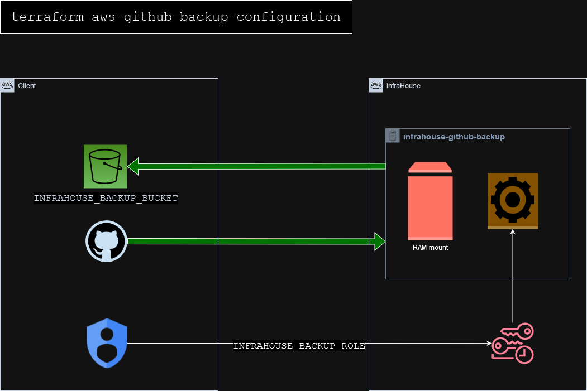

# terraform-aws-github-backup-configuration
The module creates an S3 bucket and IAM role for GitHub backups.
The backup job is performed by a GitHub App
[InfraHouse GitHub Backup](https://github.com/apps/infrahouse-github-backup).

The module saves the bucket and role names in GitHub organization variables
`INFRAHOUSE_BACKUP_BUCKET` and `INFRAHOUSE_BACKUP_ROLE`.

The `INFRAHOUSE_BACKUP_BUCKET` bucket is owned by the client.

The `INFRAHOUSE_BACKUP_ROLE` IAM role is created in the client AWS account.
The InfraHouse role, `arn:aws:iam::493370826424:role/infrahouse-github-backup` is trusted to assume the `INFRAHOUSE_BACKUP_ROLE`.
The `INFRAHOUSE_BACKUP_ROLE` role has permissions to upload files to the `INFRAHOUSE_BACKUP_BUCKET` bucket.


An **InfraHouse GitHub Backup** worker assumes the `INFRAHOUSE_BACKUP_ROLE`, clones repositories
to a temporary tmpfs volume. Then it uploads the archives to `INFRAHOUSE_BACKUP_BUCKET` and unmounts the tmpfs volume.



## Installation

Open https://github.com/apps/infrahouse-github-backup in a browser. Click, "Configure"


If GitHub suggests, select a user. The selected user must have admin permissions in an organization you want to backup.


Select an organization. Note, **InfraHouse GitHub Backup** supports organizations only.


Select repositories you want to back up or just pick "All repositories" option. Click "Install".


Success! Now,
**InfraHouse GitHub Backup** can request a read-only temporary tokens in your GitHub organization.


Next step is to set up a backup destination S3 bucket, IAM role and permissions.

## Configuration

Use the github-backup-configuration module to provision necessary resources.
```hcl
module "github-backups" {
  source                = "infrahouse/github-backup-configuration/aws"
  version               = "1.0.0"
  bucket_prefix         = "mycompany-github-backups-"
  backup_retention_days = 90
  logs_retention_days   = 360
}
```
The module will create an S3 bucket that starts with `mycompany-github-backups-`.
Backup copies will be retained up to 90 days, and access logs to the bucket will store records up to 360 days.


## Encryption
By default, the module configures S3 server-side encryption with AWS's key. For security compliance purposes you're
likely required to use a customer managed encryption key. In this case, you can pass the key id to the module.

```hcl
resource "aws_kms_key" "mykey" {
    description             = "This key is used to encrypt bucket objects"
    deletion_window_in_days = 10
}

module "github-backups" {
    source                = "infrahouse/github-backup-configuration/aws"
    version               = "1.0.0"
    ...
    kms_master_key_id     = aws_kms_key.mykey.id
...
}
```
## Requirements

| Name | Version |
|------|---------|
| <a name="requirement_aws"></a> [aws](#requirement\_aws) | >= 5.20 |
| <a name="requirement_github"></a> [github](#requirement\_github) | ~> 6.2 |

## Providers

| Name | Version |
|------|---------|
| <a name="provider_aws"></a> [aws](#provider\_aws) | >= 5.20 |
| <a name="provider_github"></a> [github](#provider\_github) | ~> 6.2 |

## Modules

No modules.

## Resources

| Name | Type |
|------|------|
| [aws_iam_policy.infrahouse-backup](https://registry.terraform.io/providers/hashicorp/aws/latest/docs/resources/iam_policy) | resource |
| [aws_iam_role.infrahouse-backup](https://registry.terraform.io/providers/hashicorp/aws/latest/docs/resources/iam_role) | resource |
| [aws_iam_role_policy_attachment.infrahouse-backup](https://registry.terraform.io/providers/hashicorp/aws/latest/docs/resources/iam_role_policy_attachment) | resource |
| [aws_s3_bucket.infrahouse-backup](https://registry.terraform.io/providers/hashicorp/aws/latest/docs/resources/s3_bucket) | resource |
| [aws_s3_bucket.infrahouse-backup-logs](https://registry.terraform.io/providers/hashicorp/aws/latest/docs/resources/s3_bucket) | resource |
| [aws_s3_bucket_lifecycle_configuration.infrahouse-backup](https://registry.terraform.io/providers/hashicorp/aws/latest/docs/resources/s3_bucket_lifecycle_configuration) | resource |
| [aws_s3_bucket_lifecycle_configuration.infrahouse-backup-logs](https://registry.terraform.io/providers/hashicorp/aws/latest/docs/resources/s3_bucket_lifecycle_configuration) | resource |
| [aws_s3_bucket_logging.infrahouse-backup](https://registry.terraform.io/providers/hashicorp/aws/latest/docs/resources/s3_bucket_logging) | resource |
| [aws_s3_bucket_public_access_block.public_access](https://registry.terraform.io/providers/hashicorp/aws/latest/docs/resources/s3_bucket_public_access_block) | resource |
| [aws_s3_bucket_server_side_encryption_configuration.default](https://registry.terraform.io/providers/hashicorp/aws/latest/docs/resources/s3_bucket_server_side_encryption_configuration) | resource |
| [aws_s3_bucket_versioning.enabled](https://registry.terraform.io/providers/hashicorp/aws/latest/docs/resources/s3_bucket_versioning) | resource |
| [aws_s3_bucket_versioning.infrahouse-backup-logs](https://registry.terraform.io/providers/hashicorp/aws/latest/docs/resources/s3_bucket_versioning) | resource |
| [github_actions_organization_variable.infrahouse-backup-bucket](https://registry.terraform.io/providers/integrations/github/latest/docs/resources/actions_organization_variable) | resource |
| [github_actions_organization_variable.infrahouse-backup-role](https://registry.terraform.io/providers/integrations/github/latest/docs/resources/actions_organization_variable) | resource |
| [aws_iam_policy_document.infrahouse-backup](https://registry.terraform.io/providers/hashicorp/aws/latest/docs/data-sources/iam_policy_document) | data source |
| [aws_iam_policy_document.infrahouse-backup-trust](https://registry.terraform.io/providers/hashicorp/aws/latest/docs/data-sources/iam_policy_document) | data source |
| [aws_iam_policy_document.permissions](https://registry.terraform.io/providers/hashicorp/aws/latest/docs/data-sources/iam_policy_document) | data source |

## Inputs

| Name | Description                                                        | Type | Default | Required |
|------|--------------------------------------------------------------------|------|---------|:--------:|
| <a name="input_backup_retention_days"></a> [backup\_retention\_days](#input\_backup\_retention\_days) | How many days to keep backup copies.                               | `number` | `30` | no |
| <a name="input_bucket_prefix"></a> [bucket\_prefix](#input\_bucket\_prefix) | A prefix for S3 bucket name. | `string` | `"infrahouse-backup-"` | no |
| <a name="input_kms_master_key_id"></a> [kms\_master\_key\_id](#input\_kms\_master\_key\_id) | Customer managed KMS key id for the bucket encryption.             | `any` | `null` | no |
| <a name="input_logs_retention_days"></a> [logs\_retention\_days](#input\_logs\_retention\_days) | How many days to keep access logs to the bucket with backup copies | `number` | `360` | no |

## Outputs

| Name | Description |
|------|-------------|
| <a name="output_backup_role_arn"></a> [backup\_role\_arn](#output\_backup\_role\_arn) | IAM role ARN for GitHub backups. |
| <a name="output_backup_role_name"></a> [backup\_role\_name](#output\_backup\_role\_name) | IAM role name for GitHub backups. |
| <a name="output_bucket_name"></a> [bucket\_name](#output\_bucket\_name) | AWS S3 bucket for GitHub backups. |
